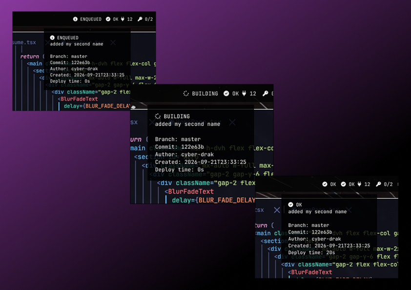

# waybar-netlify-status

Waybar custom module that shows the latest Netlify deploy status for multiple sites.

Requires `curl`, `jq`, and Font Awesome 6 Free Solid in the Waybar font stack.

## Preview



## Setup

```bash
cp .env.example .env
chmod 600 .env
chmod +x netlify.sh
```

Set in `.env`:

```bash
NETLIFY_AUTH_TOKEN="your_token"

NETLIFY_SITES=(
  "website:your_site_id"
  "void:your_site_id"
)
```

`NETLIFY_SITES` uses the format:

```text
name:site_id
```

The site ID can be found in the Netlify site settings.

## Waybar

```jsonc
"custom/netlify": {
  "exec": "/path/to/waybar-netlify-status/netlify.sh",
  "return-type": "json",
  "interval": 15,
  "tooltip": true,
  "format": "{}"
}
```

Reload:

```bash
killall -SIGUSR2 waybar
```

## Behavior

The module shows the overall status of all configured sites.

`ready` is shown as `OK`.

Icons are mapped for `ready`, `enqueued`, `building`, and `error`. Other states use a default icon.

The tooltip shows each site's status, deploy title, branch, commit, author, created time, and deploy time.

## License

MIT
